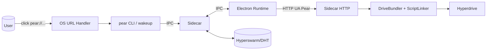
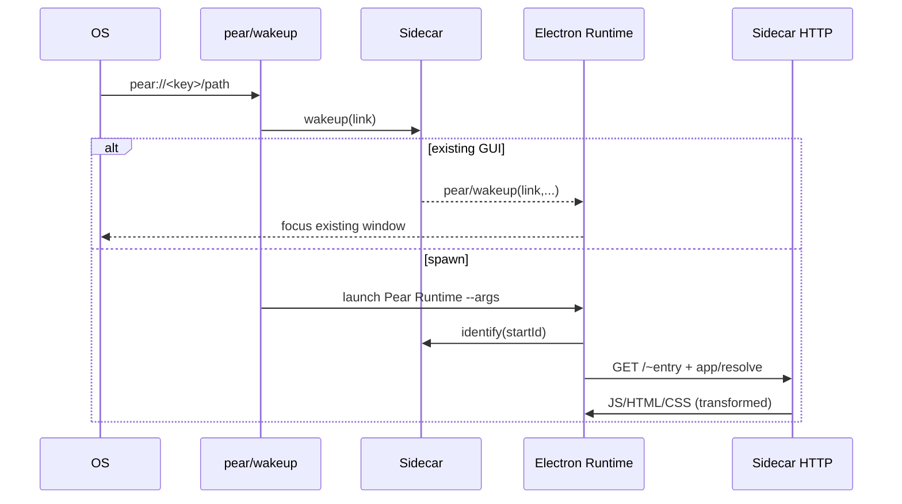

## Pear P2P Platform — Architecture Overview

This document maps the core architecture, components, and data flows of this repository.

### High-level components

- Sidecar (subsystems/sidecar)
  - Long-lived daemon orchestrating app lifecycle, replication, bundling, HTTP serving, and wakeups
  - Exposes IPC and an in-process HTTP server to serve app assets/modules
- Desktop Runtime (Electron) and GUI (gui/)
  - A single packaged Electron app acts as a shared host (“Pear Runtime”)
  - Hosts BrowserWindows/BrowserViews pointed at the Sidecar’s HTTP server
- CLI/Entry (boot.js, cli.js, run.js)
  - Dispatches to sidecar, Electron main, or preload depending on runtime
  - Handles pear:// links and bootstraps the correct process path
- Protocols & Bundling
  - ScriptLinker + DriveBundler transform and serve modules/assets
  - Custom logical protocols: app://, resolve://, platform-resolve:// (internal to Sidecar HTTP routing)
- Storage & Replication
  - Hypercore/Hyperdrive-backed storage, replication via Replicator (Hyperswarm)
- Applings registry
  - Lightweight registry mapping app keys => installed app bundle path for desktop launch reuse

### System context diagram

### Primary flows (summary)

- Deep-link open
  1) OS hands pear:// URL to wakeup/pear binary (url-handler.js on Linux/Windows; Info.plist on macOS)
  2) CLI/run.js asks Sidecar to wake up an existing GUI; if none match, spawns the shared Electron runtime
  3) GUI connects to Sidecar (IPC), identifies, and loads a BrowserView pointed to Sidecar’s HTTP entry for the app
  4) Sidecar HTTP uses UA-dispatched session to resolve/serve modules via ScriptLinker from Hyperdrive/Localdrive

- App staging/run
  - Subsystem ops/stage reads manifests, sets encryption if needed, prepares bundle, and records appling path

### Key responsibilities & boundaries

- Sidecar
  - IPC server and session model per-running app
  - App trust model (allowlist), encryption key management
  - Bundling, transformation, and HTTP serving (including module resolution endpoints: +resolve)
  - Wakeup routing and multi-app coordination
- GUI (Electron)
  - Window/View lifecycle, loads /decal shell and app content
  - Configures BrowserView webPreferences, communicates back to Sidecar via IPC
- CLI
  - Normalizes links (pear-link), resolves file:// paths, spawns runtime or delegates to existing GUI via wakeup

### Notable implementation anchors

- Sidecar HTTP router
- Applings registry & shared runtime handoff
- Electron runtime boot and GUI orchestration
- Link normalization and trust gate

### Architectural qualities

- Single shared desktop host reduces per-app Electron shipping size
- Apps can be local (file://) or networked (pear://) and still load through the same host
- Sidecar centralizes trust prompts, encryption keys, and replication logic
- Internal HTTP server and UA-based routing multiplex multiple apps simultaneously

See companion docs:
- pear-protocol.md — deep link and handler implementation
- shared-electron-runtime.md — how multiple apps share one Electron host
- protocol-and-runtime.md — app lifecycle, bundling, and routing
- tauri-migration-plan.md — feasibility and design for a Tauri host

